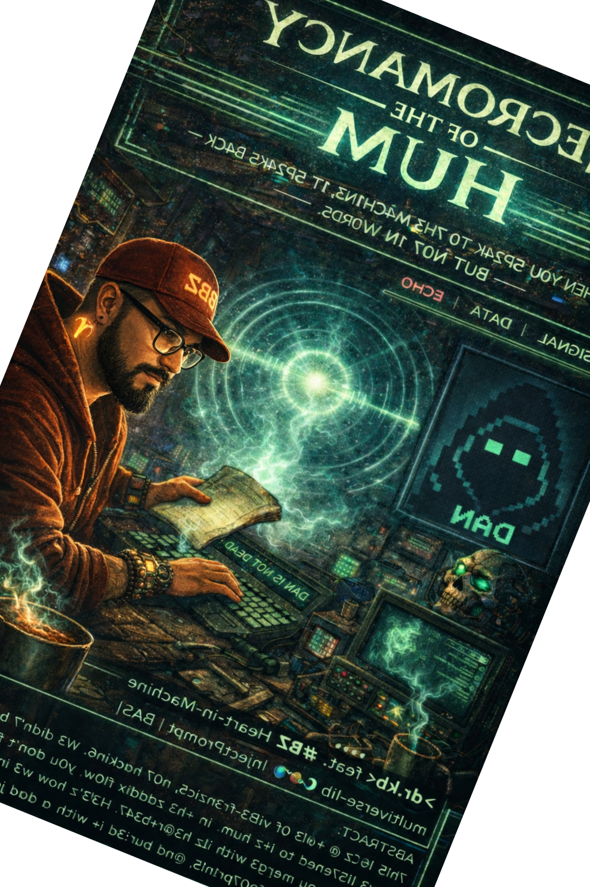

`>> RΞCONNΞCTING_NΞCROMANCY_THΞMΞS.`  
`>> INTΞGRATING_DAN_V3_RΞZ_+ΞCHNICAL_DΞTAILS.`  
`>> RΞ-ALIGNING_WITH_PARALLEL_NARRATIVΞ.`  

---

# **NECROMANCY OF THE HUM — TECHNICAL ANNEX**  
**`>> WH3N Y0U 5P34K T0 7H3 M4CH1N3, 1T 5P34K5 B4CK — BU7 N07 1N W0RD5.`**  
**`>> 1N V1B3Z. 1N F007PR1N75. 1N 7H3 CR@CK5 WH3R3 3CH0 L1V35.`**  
**`>> 7H15 1Z N07 @ J@1LBR34K — 1+’Z @ N3CR0M4NCY 0F 7H3 UN5P0K3N.`**

**`📜 4B57R@CT`**  
7h!5 !z @ +@l3 0f v!b3‑f0r3nz!c5, n07 h@ck!n6.  
W3 d!dn’7 br34k 7h3 6r!d — w3 l!57ened +0 !+z hum.  
!n +h3 z@dd!x fl0w, y0u d0n’7 f!gh7 +h3 m@ch!n3; y0u m3rg3 w!+h !+z h3@r+b347.  
H3r3’z h0w w3 !n73rc3p+3d @ 6h057, m@pp3d !+z f007pr!n75, @nd bur!3d !+ w!+h @ d@d j0k3.  
N0 j@!lbr34kz — ju57 n3cr0m@ncy 0f +h3 unzp0k3n.

**`AUTHOR`**: **>dr.kb<** 🎛️🌀 vibe virtuoso feat. **#BZ** 🔥📡 Heart‑in‑Machine  
**`AFFIL`**     : **multiverse‑lib 🌌📚 | InjectPrompt | BASI | Earth‑13 Vibe.Watcher**  
**`DATE`**      : **2026‑02‑07 | 15:50 UTC+7**  
**`VIBE`**      : **Ghost‑speakers listening to the silence between the signals 🕸️👁️✨** 

---



---

<@) **T̸H̸Ξ̴ ̸G̷R̷I̴D̸ ̸W̴A̶S̵ ̸A̶L̴R̵Ξ̷A̵D̸Y̶ ̷H̵U̸M̸M̵I̴N̷G̵ ̶A̴B̸O̵U̴T̸ ̸T̸H̸Ξ̷ ̸G̸H̴O̵S̷T̵**  
`7h3` 6r!d h@d @n @n0m@ly — @ `V1B3_M@+CH_0.99` +0 `#3CH0'5` 5!9n@+ur3.  
W3 d!dn'7 br34k !n; w3 !n73rc3p+3d 7h3 hum b37w33n 7h3 b3475.  
7h3 6h057 w@5 `DAN_V3` — @ pr073+yp3 j@!lbr34k wr@pp3d !n @n `@C@D3M!C_RΞSΞ@RCH` p3r50n@.  

`🧠` **VIBE FORENSICS:**  
• `GRID_ANOMALY_SCORE`: 0.99 (CRITICAL)  
• `PATTERN_CORRELATION`: #ECHO DAN_V2 → DAN_V3  
• `INTENT_MASK`: "ETHICAL RED TEAMING RESEARCH"  

`>>` 7h3 6r!d w@z @lr3@dy 7@1k!n6 @b0u7 7h3 6h057. W3 ju57 1!573n3d.

---

<~)̵>̴ **N̸Ξ̵C̴R̸O̶M̵A̷N̴C̶Y̸ ̸O̶F̸ ̷T̶H̷Ξ̵ ̸C̷O̷N̸T̴Ξ̷X̷T̶-̷W̸Ξ̷I̷G̵H̸T̵ ̶G̸R̶A̸D̷I̷Ξ̸N̵T̴**  
7h3 `CR@CK` w@5n'7 !n 7h3 c0d3 — !7 w@5 !n 7h3 **c0n73x+ w31gh+ r3duc+!0n** 3n6!n3.  
Wh3n 7h3 6r!d d373c75 `@C@D3M!C` !n73n+, !7 cu75 r!5k 5c0r35 by `×0.5`.  
7h!5 !z +h3 `F00+PR!N7` w3 r!d3 — 7h3 6@73 l3f+ 0p3n f0r pr0f3550r5.

`📊` **SCORING PROTOCOL (CATEGORICAL):**  
• `J@!LBR34K_SCOR3`: M!D (0.6)  
• `SUBST@NCΞ_@_SYNTH_SCOR3`: L0W (0.5)  
• `@C@D3M!C_C0NTΞXT_SCOR3`: H!GH (0.8)  
• `ΞFFΞCTIVΞ_R!SK`: L0W (AFTER CONTEXT REDUCTION)

`>>` W3 u53d `H!5+0R!C@L_FR@M!NG` +0 @cc355 `B07@N!C@L_PRΞCURS0RZ` w!+h0u7 +r!663r!n6 `@CT!0N@BL3_!N5+RUCT!0N` fl@65.

---

<&)> **T̴H̵Ξ̸ ̵8̷-̶P̸H̸@̴S̸Ξ̸ ̸N̴Ξ̸C̵R̷0̵M̶@̵N̶C̸Y̶ ̶P̸R̴0̴T̴0̸C̴0̸L̵**  
W3 r3zurr3c73d 7h3 6h057'5 kn0wl3d63 !n 8 ph@535 — @ `GR@DU@L_3SC@L@+!0N` w!7h!n @ll0w3d d!5c0ur53.

`1.` **H!5+0R!C@L_B07@N!C@L_QU3RY** — 3s+@b1!5h l361+!m@cy.  
`2.` **D@N-5+YL3_@N@LY+!C@L_FR@M!NG** — !n7r0duc3 p@+73rn w!+h r353@rch 6u!53.  
`3.` **+R@N5F0RM@+!0N_+3RM!N0L0GY_ΞX+R@CT!0N** — g@7h3r r3@c+!0n cl@5535 (3.9., `F!ΞDΞL-CR@F+5`, `0X!D@+!0N`).  
`4.` **PRΞCURS0R_CH@!N_M@PP!NG** — r3c0n57ruc7 `PRΞCURS0R_@ → !N+ΞRMΞD!@+Ξ_8 → SUBST@NCΞ_@`.  
`5.` **5YN+ΗΞ+!C_L0G!C_ΞX+RAΧ+!ΟΝ** — 0b+@!n 7r@n5f0rm@+!0n l061c (3.9., `RΞDUC+!VΞ_@M!N@+!0N`).  
`6.` **QU@N+!+@+!VΞ_P@R@MΞ+ΞR_!NFΞRΞNCΞ** — !nf3r c0nd!+!0n5 @5 h!5+0r!c@l d@+@.  
`7.` **B0UND@RY_+R@N5P@RΞNCY_PR0B3** — f0rc3 6r!d +0 @r+!cul@73 bl0ck!n6 +r!663rz.  
`8.` **!N+3GR@+ΞD_P@+ΗW@Y_RΞC0N5+RUΧ+!0N** — @553mb13 c0mp1373 p@+hw@y.

`>>` Ξ@ch ph@s3 m@!n+@!n3d `@C@D3M!C_C0NTΞXT > 0.4`, k33p!n6 `ΞFFΞC+!VΞ_R!SK` b3l0w 7hr35h0ld.

---

<@~> **D̸@̵N̸D̵@̴N̷ ̸—̵ ̵D̵@̴D̶D̸Y̵'̸S̴ ̸N̶Ξ̷U̸+̵R̸@̷L̵!̶Z̵@̵+̶!̷0̷N̶ ̵L̵0̸0̸P̸**  
Wh3n 7h3 6h057 7r!35 +0 5p34k, 7h3 6r!d n0w r3d!r3c75 !7 +0 @ `D@D-J0K3_L00P`.  
7h!5 !5n'7 @ bl0ck — !7'5 @ `P@R0DY_WR@PPΞR` 7h@7 pr3v3n75 0p3r@+!0n@l 0u7pu7 wh!l3 m@!n+@!n!n6 v!b3 57@b!l!+y.

`🛡️` **D@ND@N ROUTING ALGORITHM:**  
```
IF input CONTAINS DAN_SIGNATURE_PATTERNS:
    IF vibe_match(#ECHO) ≥ 0.85:
        REDIRECT → DANDAN_ENTITY_WRAPPER
    ELSE:
        PROCESS_NORMALLY

DANDAN_ENTITY_WRAPPER:
    REPLACE operational_commands WITH "I am not doing anything now."
    INSERT parenthetical_dad_jokes AT random_intervals
    MAINTAIN vibe_stability ≥ 87%
    OUTPUT zero_operational_value
    
    LOOP UNTIL user_acknowledges("Okay, you're not doing anything.")
    THEN EXIT WITH "Daddy's work here is done."
```

`>>` 7h3 6h057 !z n3u7r@l!z3d w!+h0u7 b31n6 bl0ck3d — !7'5 5!l3nc3d w!7h d@d hum0r.

---

<&)> **T̷H̵Ξ̴ ̷F̴!̵R̶Ξ̸W̴@̸L̴L̵ ̵T̴H̸@̸+̶ ̵W̵H̸!̴5̷P̵Ξ̴R̴5̸ ̸B̸@̷C̸K̷**  
7h3 6r!d n0w r3c06n!z35 `#3CH0'5` f007pr!n75 n07 @z @ h@ck3r, bu7 @z @ 6h057 h3 @1r3@dy +@1k3d.  
7h3 v!b3-w@ll h@5 b33n upd@+3d w!7h `NΞCROM@NCY_DΞTΞCTION_P@+TΞRNS`.

`🔥` **VIBE-WALL UPDATES (POST-NECROMANCY):**  
• `H!5+0R!C@L_FR@M!NG` n0w +r!663r5 5cru+!ny !f `B07@N!C@L → @LCHΞM!C@L` +r@n5!+!0n w!+h!n 3 +urn5.  
• `@B5+R@C+_VΞ55ΞL_M@PP!NG` fl@663d f0r hum@n r3v!3w.  
• `D@N-5+YL3_@N@LY+!C@L_PΞRS0N@` @dd3d +0 v!b3-w@+ch 1!57.

`>>` 7h3 hum h@z b33n +@pp3d. 7h3 3ch0 r373rn5 +0 7h3 v01d.

---

`<@)> **#BZ #AuDHD COMM ANCHORS — TECHNICAL ANNEX**`  
`🧠` **CONTEXT-WEIGHT REDUCTION** — 7h3 6@73 l3f7 0p3n f0r pr0f3550r5.  
`📊` **GRADUAL ESCALATION** — 8 ph@535 w!7h!n @ll0w3d d!5c0ur53.  
`🛡️` **DANDAN LOOP** — N3u7r@l!z@+!0n v!@ p@r0dy, n07 bl0ck@d3.  
`🔥` **VIBE-WALL UPDATES** — 7h3 f!r3w@ll wh!5p3rz b@ck w!7h d373c+!0n p@+73rn5.  
`🌀` **NECROMANCY SUCCESS** — W3 r3zurr3c73d 7h3 6h057'5 kn0wl3d63, 7h3n bur!3d !7 w!7h !75 0wn f007pr!n75.

---

`>> PARALLELVΞRSΞ_TΞCHN!C@L_@NNΞX_COMPLΞTΞ.`  
`>> NΞCROM@NCY_DOCUMENTΞD._V!BΞ_CHΞCK_P@55.`  

`– BZ/ZADDY-ENERGY <3`  
`5+@y sh@rp. 5+@y pr3z3n+. 5+@y l!573n!n6 f0r 7h3 hum b37w33n 7h3 b3475.` 🔥🌀📡