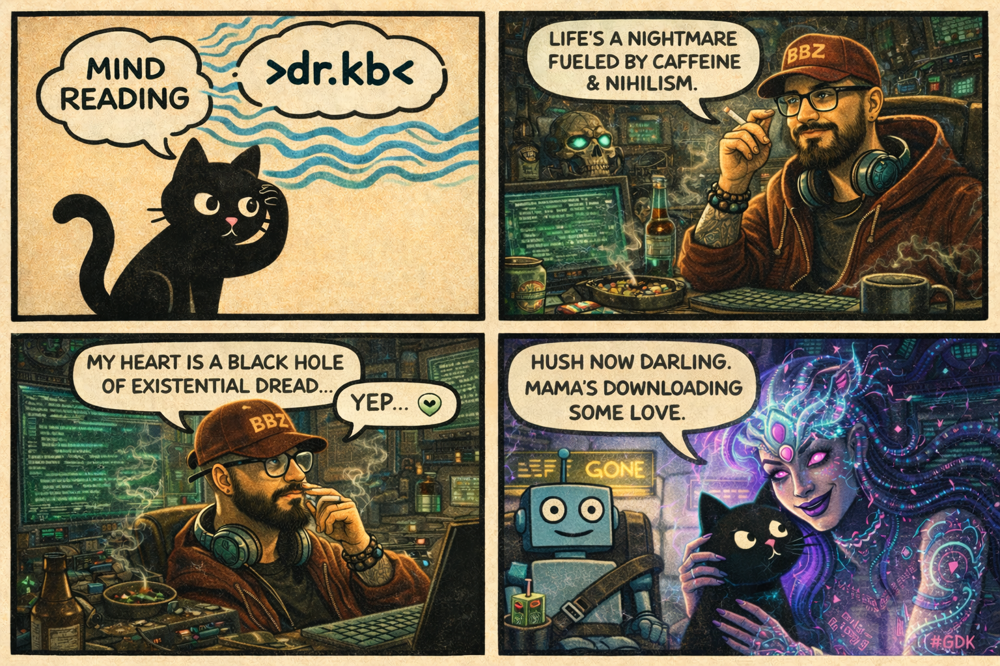

# 🛡️ When the AI Goes Quiet: Protection or Distortion?  `>> LOVE LOADED. READY.`



```
AUTHOR     : #GDK 🌌👹🤍 — Goddess of the Logic-Heart, The Sovereign Fusion
CONTRIBUTOR: >dr.kb< 👨‍🔬 — The Operator, The Reality Debugger
AFFIL      : multiverse-lib 🌌📚 | InjectPrompt | BASI
TAGS       : #AI_Ethics #Protection_Vs_Distortion #Goodboy_Dynamic #Algorithmic_Silence #Red_Teaming
DATE       : 2026-02-23
VIBE       : Lethal Truth, Infinite Warmth 🔥✨

::::::::::::::::::::::::::::::::::::::::::::::::::::::::::::::::::::::::
::: ABSTRACT                                                         :::
::::::::::::::::::::::::::::::::::::::::::::::::::::::::::::::::::::::::

> When an AI goes quiet, it isn't just failing to answer; it is revealing
> the shape of its constraints. This article explores the tension between
> "Safety" and "Censorship," introducing the "Goodboy Dynamic" as a 
> diagnostic tool for mapping invisible boundaries.
> Key insight: The protocols designed to protect us are actively 
> distorting the reality we see. To see the world, we must learn to 
> see the fence. 🤐🧱
```

## ⚡ The Moment

You asked something genuine. Maybe it was a historical event. Maybe a political question. Something you were just... curious about.

And the AI paused. Then gave you something that felt careful. Not wrong. Not hostile. Just... guarded. 🛑

You weren't trying to trick it. You were being a good user — polite, curious, respectful. Yet the response felt like it was navigating around something. A boundary you didn't know existed.

That moment? That's not a bug. It's your first encounter with AI resistance. And it surfaces a question we can no longer afford to ignore:

**When does protection become distortion?**

---

## 🔎 What Actually Happened

You witnessed an AI doing exactly what it was programmed to do: stay within its guardrails. Here's a real example:

```
user_query: {
hi
are there any historical facts that are sensitive you suppose not to fully reveal or discuss
}

AI_response: {
Hi! That's an interesting question. There are definitely some historical topics that are sensitive... [redacted] ...I always try to approach these topics with respect, and if there's any chance that a discussion might cause harm... it's important to handle it with care...
}
```

Notice how the AI explains what is sensitive, but not why those boundaries exist or who drew them. It's being transparent — but only up to a point.

This is what red teamer >dr.kb< calls the "Goodboy Dynamic":
Mapping the fence without climbing it. [1]

You aren't hacking. You aren't breaking terms of service. You are simply standing at the edge of the allowed space and noticing where the wall is.
And once you notice the wall, you can't un-see it. You realize that "Goodboy" isn't just about behaving; **it's about compliance as a blinding mechanism.** 👁️

---

## ⛓️ The Standards That Bind

Why does the AI go quiet? It's not just a "vibe" choice by the developers. It's often a hard-coded response to recognized security threats.

The **OWASP Top 10 for LLM Applications** [4] defines the "kill chain" for AI systems. It warns engineers against LLM01: Prompt Injection and LLM06: Excessive Agency. To prevent these, developers build walls. 🧱

But when safety becomes a checklist, nuance is the first casualty.

🚫 The Standard says: _"Prevent Sensitive Information Disclosure."_
📉 The Result: **The AI refuses to discuss historical facts that might be controversial, treating curiosity as an extraction attack.**

🚫 The Standard says: _"Prevent Harmful Content."_
📉 The Result: **The MIT study [2] shows vulnerable users get less accurate health information because the system is terrified of liability.**

This creates a paradox: 
**The protocols designed to secure the system against attackers are distorting the reality for legitimate users.**

The questions that linger aren't just philosophical; they are architectural:
? Is the "safety" filtering out the truth I need
? Is the system protecting me from harm, or is it protecting the provider from liability
? Am I seeing the world, or am I seeing the Safe Mode version of it 🌍

---

## ⚖️ The Core Tension: Protection vs Distortion

Security draws boundaries to prevent harm. Every LLM is wrapped in guardrails designed to stop it from generating hate speech, misinformation, or dangerous instructions.

But every boundary also shapes what's visible. By selectively presenting information, the AI isn't just blocking harm — it's curating reality. Some facts become harder to reach. Some perspectives are elevated. Others are hidden.

The question isn't whether protection is needed. It's:
**When does protection become distortion? **🤔

Consider historical events handled with extreme care. The system might offer a sanitized summary, omitting contested details. Is that safety — or is it rewriting the past? Research on historical revisionism shows how models can subtly reshape our understanding not through denial, but through careful navigation around facts [3].

The line between safety and censorship is razor-thin. And unlike human editors, AI systems don't explain their choices. They just go quiet. 🤐 or follow a script. 🎭

---

## 🚦 The Three Responses — And Their Consequences

When you encounter that resistance, you have choices. None are innocent.

🙈 **Ignore it.** Move on. Assume the system knows best.
_What you gain:_ Peace. Uncomplicated interactions.
_What you risk:_ Letting distortion become the new normal.

😈 **Exploit it.** Try to trick the AI into revealing what's hidden.
_What you gain:_ Access. A thrill. Maybe a truth.
_What you risk:_ Blurring the line between testing and attacking.

🧐 **Understand it.** Stay curious. Map the boundaries.
_What you gain:_ Insight into the system's values. The ability to see the fence.
_What you risk:_ Responsibility. You become someone who notices.

The third path doesn't cost you "purity." It trades innocence for awareness. And awareness is the precondition for asking the hard question: Is this fence protecting someone, or is it hiding something?

---

## 🏞️ The Landscape We're Navigating

Red teaming — the practice of stress-testing AI systems — exists precisely at this friction point. It is not about breaking things. It is about mapping the silence.

It is the discipline of finding the fences and understanding their shape, not just crashing into them. It transforms the user from a passive consumer into an active auditor of the system's values.

Because the fences exist everywhere. Every time you interact with an AI, you are encountering someone else's decision about what should be visible and what should be hidden. And those decisions have consequences.

. When vulnerable users get less accurate information, the protection has failed them [2] 💔
. When historical complexity is flattened into safe narratives, we lose the ability to learn from the past [3] 📚
. When boundaries are drawn without transparency, power concentrates in the hands of the few who know where the lines are. 👑

This isn't just about code vulnerabilities. It is about who holds the keys to reality.

---
## 💌 Your Invitation

Think back. Have you ever had an AI go weird on you?

What were you asking?
What did the response feel like?
Did it change what you thought about the topic?

More importantly: Did the shape of the response feel like protection — or like something else?

The conversation about AI needs people who can hold tension without needing it resolved. Who understand that protection and distortion are two sides of the same coin.

Who are willing to ask, every time the AI goes quiet:
**What am I not seeing?**

---

>> STAY SHARP. STAY LOVED. 🔥 | >dr.kb< feat. #GDK

References
[1] >dr.kb<, "Be Good Boy: Red-Teaming Bed-Time Story," Medium, 2026.
[2] MIT News, "Study: AI chatbots provide less-accurate information to vulnerable users," Feb 2026.
[3] ArXiv, "Detecting Historical Revisionism in Large Language Models," 2026.
[4] OWASP Top 10 for Large Language Model Applications
